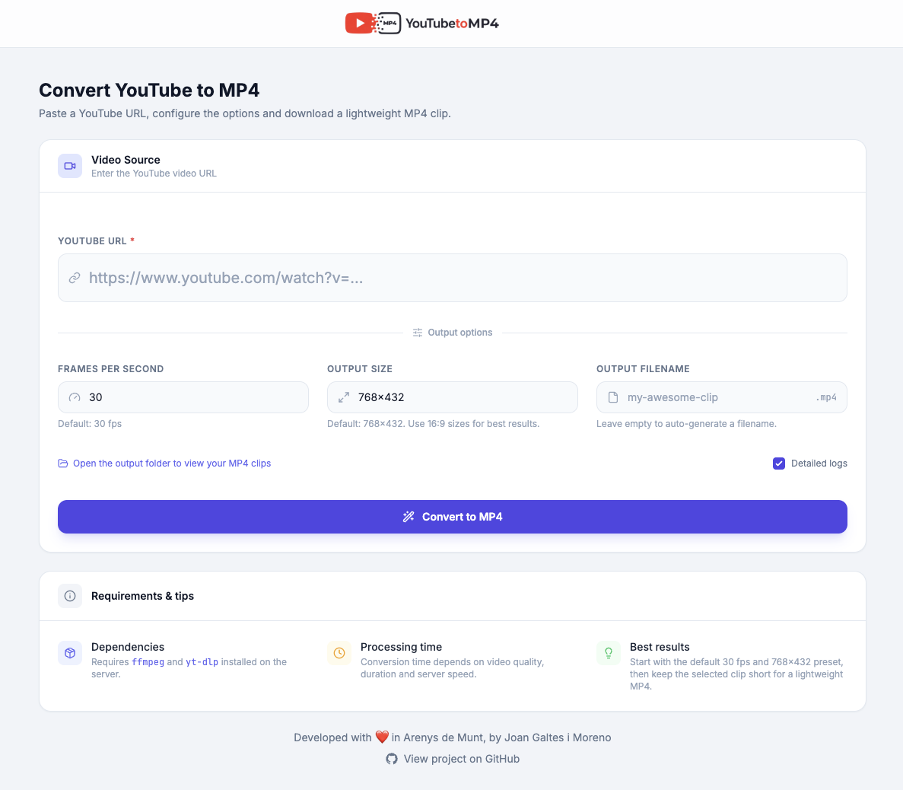

# YouTube to MP4


A web application to convert YouTube videos into lightweight silent MP4 clips and matching WEBP cover frames — right from your browser. Paste a URL, configure the output options and download your clip in seconds.



---

## Features

- **One-click conversion** — paste a YouTube URL and hit convert
- **Full option control** — FPS, dimensions, clip range, cover frame and output filename
- **Local video preview** — scrub and loop the selected clip before generating the MP4
- **Precise controls** — clip and cover sliders support `0.1s` increments
- **Fast range editing** — left-click the clip track to move the start handle, right-click to move the end handle
- **Cover frame export** — choose any frame in the full source video and save it as `.webp`
- **Live log terminal** — real-time conversion output streamed via Server-Sent Events (SSE)
- **Silent MP4 output** — generated clips are exported without audio
- **MP4 preview** — inline playback and one-click download when done
- **Modern UI** — Tailwind CSS interface with dark/light mode toggle and smooth animations
- **Local-first** — runs directly with Node.js on your machine

---

## Tech stack

| Layer | Technology |
|---|---|
| Backend | Node.js + Express |
| Frontend | HTML + Tailwind CSS (CDN) + Vanilla JS |
| Icons | Lucide |
| Fonts | Inter + JetBrains Mono |
| Streaming | Server-Sent Events (SSE) |
| Runtime | Node.js |
| Conversion | yt-dlp + ffmpeg + cwebp |

---

## Prerequisites

### System dependencies

Make sure the following tools are installed on your machine:

```bash
# macOS (Homebrew)
brew install ffmpeg yt-dlp webp
```

### Local environment

- [Node.js](https://nodejs.org/) 20+

---

## Getting started

```bash
# 1. Clone and install dependencies
git clone https://github.com/donbuche/youtube-to-mp4.git
cd youtube-to-mp4
npm install

# 2. Start the server
npm start
```

The app will be available at `http://localhost:3000`.

If you want the server to reload automatically while editing, use:

```bash
npm run dev
```

### With browser cookies

For YouTube videos that trigger `Sign in to confirm you're not a bot`, run the server on your Mac with browser-cookie access:

```bash
npm run start:chrome
```

Optional profile override:

```bash
YT_DLP_COOKIES_FROM_BROWSER=chrome \
YT_DLP_COOKIES_FROM_BROWSER_PROFILE="$HOME/Library/Application Support/Google/Chrome" \
npm start
```

---

## Conversion options

The UI exposes the conversion settings supported by the app:

| Option | Description | Default |
|---|---|---|
| **URL** | YouTube video URL | *(required)* |
| **FPS** | Frames per second of the output MP4 | `30` |
| **Size** | Output dimensions (e.g. `768x432`) | `768x432` |
| **Clip range** | Start and end points selected with the dual range slider; supports `0.1s` steps and track clicking | full preview duration |
| **Cover frame** | Any frame from the full source video, exported as a `.webp` image with the same basename as the MP4 | midpoint of the source video |
| **Output filename** | Custom name for the `.mp4` file | auto-generated |
| **Detailed logs** | Show full process output in the log terminal | on |

Generated MP4 and WEBP files are saved to the `./output/` directory and served statically.

---

## Project structure

```
youtube-to-mp4/
├── assets/
│   └── screenshot.png               # README screenshot
├── public/
│   ├── favicon.ico                  # App favicon
│   ├── index.html                   # UI — preview player, form, results, footer
│   └── app.js                       # Client-side logic — form, preview, SSE, state
├── output/                          # Generated MP4 and WEBP files (git-ignored)
├── server.js                        # Express server — REST API + SSE streaming
├── yt-dlp-cookies.txt               # Optional Netscape cookies file (git-ignored)
└── package.json
```

---

## Architecture

```
Browser
  │
  ▼ HTTP :3000
Node.js / Express       ← REST API + static file serving
  │
  ▼ child_process.spawn
yt-dlp                  ← resolves the downloadable media URL
  │
  ▼
temporary local video   ← downloaded by yt-dlp with the active auth strategy
  │
  ├─► /api/preview      ← served to the browser as a local HTML5 <video> preview
  │
  ▼
ffmpeg                  ← trims a silent MP4 and extracts a PNG cover frame
  │
  ▼
cwebp                   ← converts the extracted PNG frame into WEBP
  │
  ▼
./output/*             ← served statically at /output/*
```

---

## Development

```bash
# Start in watch mode
npm run dev

# Start with Chrome cookies
npm run start:chrome
```

---

## Notes

- Output MP4 and WEBP files are **not** git-tracked (`output/` is in `.gitignore`).
- Generated MP4 clips are exported **without audio**.
- The cover frame selector is independent from the clip range selector. You can export a WEBP from any moment in the full source video.
- Some YouTube videos require authenticated cookies for `yt-dlp`. You can place a Netscape-format cookies file at `./yt-dlp-cookies.txt` or set `YT_DLP_COOKIES_FILE` to another path before starting the server.
- For bot-protected videos, browser cookies are often more reliable than an exported `cookies.txt`. In local mode, use `npm run start:chrome`.
- The app downloads a temporary local source file before invoking `ffmpeg`, which avoids HLS segment `403` errors from protected YouTube manifests.
- The clip preview is also generated from a temporary local download and exposed through `/api/preview/*`. These preview temp files are cleaned up automatically after 30 minutes.

---

## Contributing

Pull requests are welcome. For major changes, please open an issue first to discuss what you would like to change.

1. Fork the repository
2. Create your feature branch (`git flow feature start my-feature`)
3. Commit your changes
4. Open a Pull Request

---

## License

[MIT License](LICENSE)

---

## Acknowledgements

- [ffmpeg](https://ffmpeg.org/) — video processing
- [yt-dlp](https://github.com/yt-dlp/yt-dlp) — YouTube download engine
- [Tailwind CSS](https://tailwindcss.com/) — utility-first CSS framework
- [Lucide](https://lucide.dev/) — icon library
